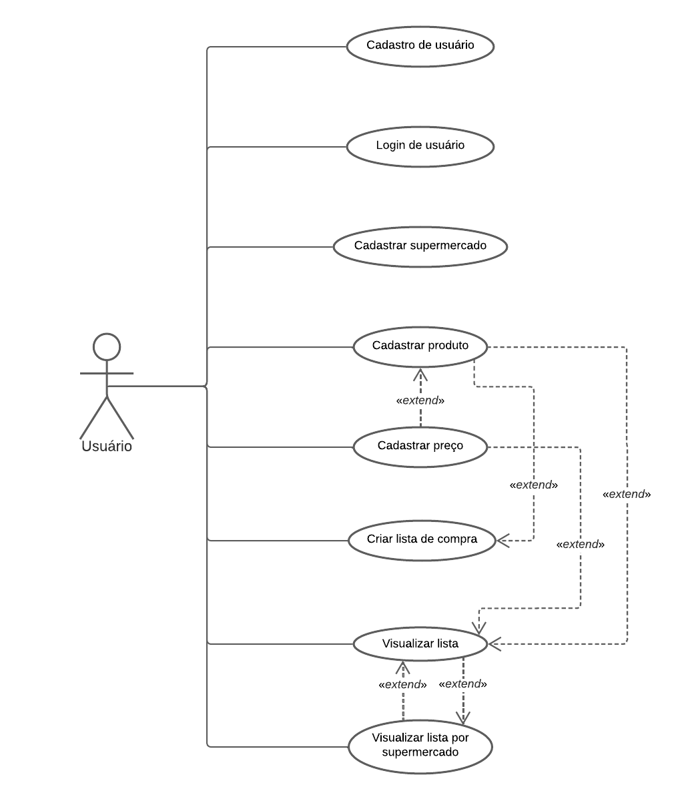

# uailist

An application that allow users to create buy lists with provided prices communally.

## Table of content

1. [Project](#project)
    - [Diagrams](#diagrams)
        - [Use cases diagram](#use-cases-diagram)
        - [Class diagram](#class-diagram)
2. [Authors](#authors)

## Project

### Diagrams

#### Use cases diagram

#### Class diagram

## Authors
- Bernardo Tavares [BernardoTM](https://github.com/BernardoTM)
- Marcos Fonseca [marcosfons](https://github.com/marcosfons)
- Priscila Melo 
